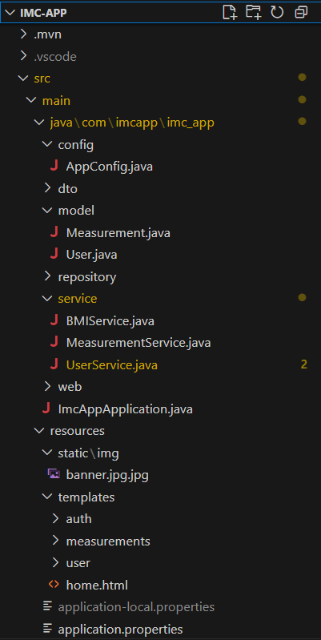

# IMC App – Aplicación Web para Calcular y Monitorear el IMC 

Aplicación web que permite a los usuarios calcular su Índice de Masa Corporal (IMC) y dar seguimiento a su progreso a través del tiempo. Incluye registro, inicio de sesión, gestión de perfil, captura de nuevas mediciones y visualización de un historial almacenado en base de datos.

Proyecto desarrollado por **Roberto Gabriel Corrales Rendón**  
Materia: **Programación Avanzada en Java**  
Universidad TecMilenio — Entrega Académica  

---

## Tecnologías utilizadas

| Tipo | Tecnología |
|------|------------|
| Lenguaje | Java 17 |
| Framework Web | Spring Boot |
| Motor de vistas | Thymeleaf |
| Persistencia | Spring Data JPA (Hibernate) |
| Base de Datos | PostgreSQL |
| Build Tool | Apache Maven |
| Patrón Arquitectónico | MVC |

---

## Funcionalidades Principales

- Registro de usuarios
- Inicio de sesión con validación de credenciales
- Cálculo automático del IMC
- Registro de nuevas mediciones
- Vista de **histórico de IMC**
- Gestión del perfil del usuario:
  - Editar información personal
  - Cambio de contraseña
- Restricción de acceso a funciones sin iniciar sesión

---

## Estructura del Proyecto

---

## Diseño de la Base de Datos

**Tabla `users`**
| Columna | Tipo | Descripción |
|--------|------|-------------|
| id | BIGSERIAL PK | Identificador |
| username | VARCHAR(60) | Único |
| password_hash | TEXT | Contraseña cifrada |
| nombre_completo | VARCHAR(120) | Datos del usuario |
| edad | INTEGER | Mínimo 15 |
| sexo | CHAR(1) | M/F/O |
| estatura_m | FLOAT | 1.00 - 2.50 |

**Tabla `measurements`**
| Columna | Tipo | Descripción |
|--------|------|-------------|
| id | BIGSERIAL PK | Identificador |
| user_id | BIGINT FK → users.id | Relación usuario |
| peso_kg | FLOAT | Peso registrado |
| estatura_snapshot | FLOAT | Estatura usada para el IMC |
| imc | FLOAT | Valor calculado |
| tomado_en_utc | TIMESTAMP | Fecha del registro |

---

### Requisitos previos
- Java 17 instalado y configurado
- PostgreSQL disponible
- Maven instalado

